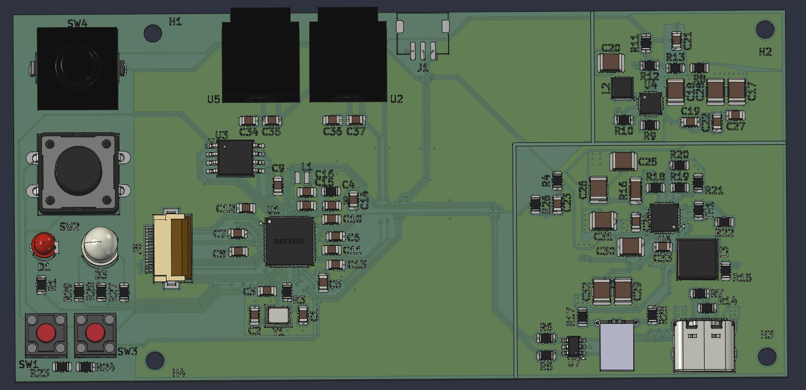
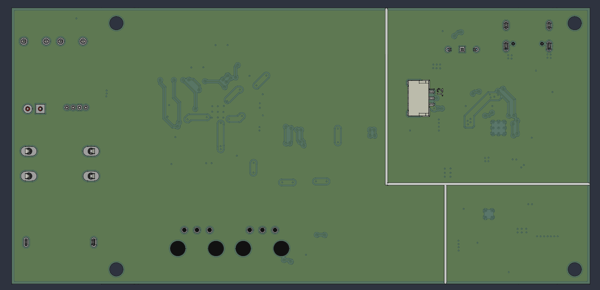
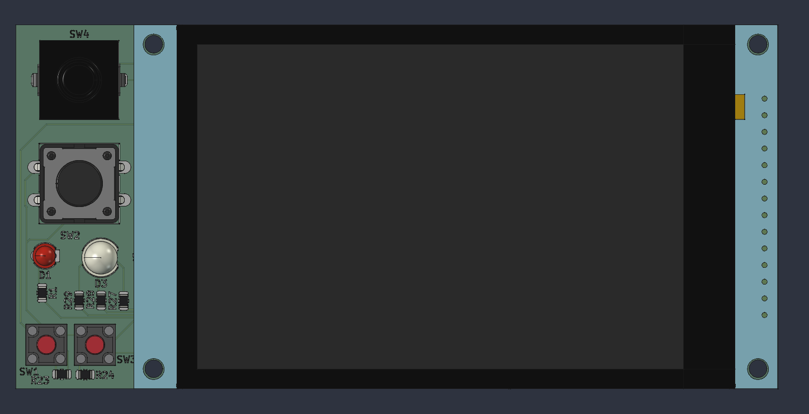

# ControlPanel for DRSSTC (RP2350)

Universal, open-source control panel for Dual Resonant Solid State Tesla Coils (DRSSTC) based on the Raspberry Pi RP2350.


<br/>

### Table of Contents
<p>
  <a href="#-overview">Overview</a> <br/>
  <a href="#-status">Status</a> <br/>
  <a href="#-getting-started">Getting Started</a> <br/>
  <a href="#-hardware-choices">Hardware Choices</a> <br/>
  <a href="#-project-history">Project History</a>
</p>


<br/>

## 📒 Overview

This project is a dedicated, portable controller for **DRSSTC (Dual Resonant Solid State Tesla Coils)**. Built around the Raspberry Pi **RP2350**, it integrates reliable, high-frequency power management, an IPS touchscreen interface, and critical hardware-level safety features required for high-voltage control.

The primary goal is to provide a robust, noise-immune controller that can reliably send pulses to a Tesla coil over fiber optics without risking signal corruption from electromagnetic interference (EMI).

---

## ⚠️ Status

> [!WARNING]
> This project is currently in the **Alpha** development phase. The core hardware architecture is established, but firmware and features are actively being updated. Treat it as experimental.

---
### 3D Screenshot





---


## 🧑‍💻 Getting Started

To clone the repository along with the required submodules for graphics libraries and drivers, run:

```bash
# Clone the repository
git clone https://codeberg.org/uki_chan228/ControlPanel_for_DRSSTC  

# Initialize and update all submodules recursively
cd ControlPanel_for_DRSSTC
git submodule update --init --recursive
```

---

## Hardware Architecture & Design Choices

### 1. MCU: Why RP2350 and not STM32?
Why did I choose the **RP2350** instead of something like the **STM32H507** or other H-series STM32 chips? It came down to high costs and counterfeits. If you want to buy an inexpensive **STM32** on AliExpress, almost all of them turn out to be clones or fakes. If you do manage to find an original, the price is quite steep. As a reliable example of genuine hardware, we can look at WeAct Studio. They have an excellent reputation, sell original dev boards, and their GitHub is an amazing resource containing schematics for all of their modules. Currently, the **RP2350** from **WeAct Studio** costs about $3. By comparison, the **STM32H** and **STM32G** series cost anywhere from $5.50 to $10. Of course, those offer more processing power and higher-quality peripherals like timers—after all, the STM32 architecture is time-tested and highly trusted. 

If we look at **STM32** alternatives, we should also mention Chinese compatible MCUs like the **AT32, GD32, APM32,** and CH32. These are essentially enhanced clones of the original **STM32**. Out of these four, GD32 (highly preferred) and **AT32** are the best choices and represent solid, reliable options to buy on AliExpress. 

But let's return to the RP2350. Its absolute killer feature is the PIO (Programmable I/O)—tiny state machines/microprocessors that run completely independently of the main CPU cores. The **RP2350** features three PIO blocks with 3 state machines each, giving you 12 independent processors in total. It is essentially a mini-FPGA built right into a microcontroller! This lets you implement almost any proprietary interface or even design your own. This is incredibly useful for my Remote Control project because I can send control pulses to a Tesla coil via fiber optics. I don't have to worry about what happens if the main processor hangs or if another button is pressed, because these tasks are handled by entirely separate hardware subsystems within the same silicon die.

In short, the RP2350 wins on cost-efficiency and unique features that can easily replace much more expensive **STM32** chips. Plus, it's a very new chip, which is also a great advantage.

### 2. Display and UI
The UI runs on an **MSP3526**, a 3.5-inch IPS display (480x320) with a capacitive touchscreen. The IPS panel allows for 16 million colors, making it comfortable to view real-time diagnostic graphs and navigate menus. 

*Safety feature:* To prevent accidental triggers, touchscreen interrupts are completely ignored at the firmware level while the RP2350 is actively transmitting pulses to the coil.

### 3. Power Supply
The board is powered by two **18650 Li-ion cells** mounted symmetrically for physical balance. 

For voltage regulation, I used the **TLV62130** step-down buck converter. I actually borrowed this idea from the Antminer S9 control boards (which use five of them). It operates at a high switching frequency (1.25MHz - 2.5MHz). Because of this high frequency, voltage ripple is minimal, and there is no need for massive filtering capacitors. It is also extremely durable, having been proven in harsh ASIC mining environments.

Charging the 2S battery pack is handled by an **IP2326** IC, which is a dedicated, highly efficient switching charger for 2-series lithium setups.

All components were selected so they can be easily sourced from AliExpress, allowing anyone to replicate this build.

---

## Project History & Acknowledgments

This project has been in active development from late January 2026 to June. It represents the time and effort of a single teenager fascinated by high-voltage engineering.

It originally started as a simple breadboard project with an ATmega328P, a character LCD1602, a rotary encoder, and a single start button. By mid-April, new ideas naturally pushed the development further, eventually evolving into the RP2350-based device you see today.

Special thanks to the **PCBWay** contest for providing a concrete deadline. Having a specific date to finish the hardware was a huge motivation to get this project across the finish line.